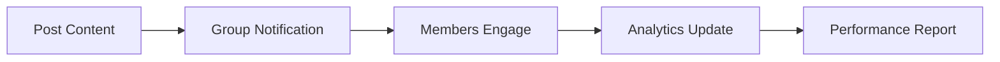

## Overview

Coterie helps creators and teams build focused communities for authentic engagement. You form small groups, called coteries, where members support each other's content across platforms. This creates real reciprocity without bots or fake interactions.

Key capabilities include circle creation, cross-platform tools, support features, and analytics. Use these to grow your audience sustainably.

<Columns cols={2}>
  <Card title="Circle Management" icon="users" href="#circle-creation">
    Create and manage private groups for targeted engagement.
  </Card>
  <Card title="Cross-Platform" icon="globe" href="#cross-platform">
    Engage seamlessly on Twitter, Instagram, and TikTok.
  </Card>
  <Card title="Reciprocity Tools" icon="heart" href="#reciprocity">
    Structured support to boost visibility and comments.
  </Card>
  <Card title="Analytics" icon="bar-chart-3" href="#analytics">
    Track performance and member contributions.
  </Card>
</Columns>

<Callout kind="tip">
  Start with 5-10 members per coterie for best results. Larger groups dilute engagement.
</Callout>

## Circle Creation and Management

Build your coterie in minutes. You invite trusted creators who align with your niche.

<Steps>
  <Step title="Create Circle" icon="plus">
    Log in to your dashboard at `https://app.coterie.rsvp`.

    Name your circle, set goals like "weekly post support", and define rules.
  </Step>
  <Step title="Invite Members" icon="user-plus">
    Share invite links via email or Discord.

    Approve members manually to ensure quality.
  </Step>
  <Step title="Set Schedule" icon="calendar">
    Configure engagement cadences, like "3 comments per post".
  </Step>
  <Step title="Manage Activity" icon="settings">
    Monitor participation and remove inactive members.
  </Step>
</Steps>

## Cross-Platform Engagement

Coterie works across major platforms. You post content, and members engage directly.

<Tabs>
  <Tab title="Twitter" icon="twitter">
    Schedule tweets and assign comment queues.

    ```javascript
    // Example: Post to Twitter via Coterie API
    const response = await fetch('https://api.coterie.rsvp/v1/posts', {
      method: 'POST',
      headers: { 'Authorization': 'Bearer YOUR_TOKEN' },
      body: JSON.stringify({
        platform: 'twitter',
        content: 'New video drop! Check it out.',
        circleId: 'coterie-123'
      })
    });
    ```
  </Tab>
  <Tab title="Instagram" icon="instagram">
    Share Reels and Stories for quick reciprocity.

    ```javascript
    // Instagram post example
    const post = await coterieClient.posts.create({
      platform: 'instagram',
      type: 'reel',
      caption: 'Behind the scenes!',
      circleId: 'coterie-123'
    });
    ```
  </Tab>
  <Tab title="TikTok" icon="video">
    Viral challenges with group support.

    ```javascript
    // TikTok integration
    await coterieClient.engage({
      platform: 'tiktok',
      videoId: 'tt-456',
      action: 'comment',
      message: 'Love this trend!'
    });
    ```
  </Tab>
</Tabs>

## Reciprocity and Support Tools

Encourage genuine interactions with built-in prompts and queues.

<Board title="Weekly Engagement Queue">
  <BoardColumn title="To Engage" color="0" icon="clock">
    <BoardCard title="Sarah's Twitter thread" description="3 likes + 1 comment" icon="twitter" dueDate="2024-12-15" />
    <BoardCard title="Mike's IG Reel" description="Watch and duet" icon="instagram" />
  </BoardColumn>
  <BoardColumn title="In Progress" color="1" icon="loader-2">
    <BoardCard title="Ana's TikTok" description="Commenting now" author="You" />
  </BoardColumn>
  <BoardColumn title="Completed" color="2" icon="check-circle">
    <BoardCard title="Last week's posts" description="All supported" createdAt="2024-12-10" />
  </BoardColumn>
</Board>

## Performance Analytics

Measure what matters: engagement lift, reciprocity rates, and growth.

<Expandable title="View Sample Dashboard Metrics" default-open="true">
  Track metrics like:

  | Metric | Description | Target |
  |--------|-------------|--------|
  | Engagement Rate | Comments per post | `>5%` |
  | Reciprocity Score | Mutual support ratio | `90%+` |
  | Member Activity | Posts per week | `3+` |

  Export data via API for custom reports.
</Expandable>



<Callout kind="success">
  Teams using Coterie see 3x comment growth in 30 days.
</Callout>

Explore [quickstart](/quickstart) for setup or [authentication](/authentication) for API access.