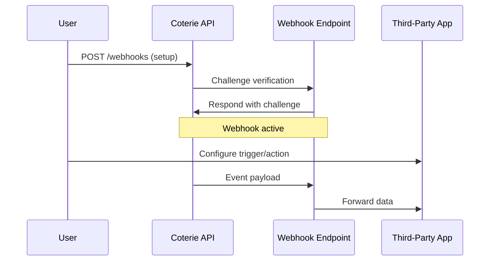

## Overview

Coterie supports seamless integrations with popular social media platforms, webhooks for real-time notifications, and third-party apps to automate your engagement workflows. You can connect your accounts to automatically post updates, track reciprocity, and trigger actions based on member interactions.

<Callout kind="info">
  All integrations require your Coterie API key, available in your dashboard at `https://dashboard.coterie.rsvp/settings/api`.
</Callout>

## Supported Platforms

Connect Coterie directly to leading social platforms for effortless content sharing and engagement tracking.

<Columns cols={3}>
  <Card title="X (Twitter)" icon="twitter" href="/docs/integrations/twitter">
    Post threads and replies automatically from your Coterie groups.
  </Card>
  <Card title="Instagram" icon="instagram" href="/docs/integrations/instagram">
    Share stories and feed posts with reciprocal support notifications.
  </Card>
  <Card title="LinkedIn" icon="linkedin" href="/docs/integrations/linkedin">
    Publish professional updates and track profile visits.
  </Card>
  <Card title="YouTube" icon="youtube" href="/docs/integrations/youtube">
    Sync video uploads and community engagement metrics.
  </Card>
</Columns>

## Webhook Configuration

Set up webhooks to receive real-time events from Coterie, such as new member joins or engagement completions.

<Steps>
  <Step title="Create Webhook" icon="settings">
    Navigate to your dashboard integrations page and click "Add Webhook".

    Enter your endpoint URL, e.g., `https://your-webhook-url.com/coterie-events`.
  </Step>
  <Step title="Verify Endpoint" icon="shield">
    Coterie sends a challenge request. Respond with the `challenge` value in the `X-Coterie-Challenge` header.
  </Step>
  <Step title="Handle Events" icon="zap">
    Process incoming POST requests with event data.
  </Step>
</Steps>

Here is a sample webhook handler:

<CodeGroup tabs="Node.js,Python">
  ```javascript
  const express = require('express');
  const crypto = require('crypto');
  const app = express();

  app.use(express.json());

  app.post('/coterie-events', (req, res) => {
    const signature = req.headers['x-coterie-signature'];
    const payload = JSON.stringify(req.body);
    const expectedSig = 'sha256=' + crypto.createHmac('sha256', 'YOUR_WEBHOOK_SECRET').update(payload).digest('hex');

    if (signature !== expectedSig) {
      return res.status(401).send('Unauthorized');
    }

    console.log('Event:', req.body.event_type, req.body.data);
    res.status(200).send('OK');
  });
  ```
  ```python
  from flask import Flask, request, abort
  import hmac
  import hashlib

  app = Flask(__name__)
  WEBHOOK_SECRET = 'YOUR_WEBHOOK_SECRET'

  @app.route('/coterie-events', methods=['POST'])
  def webhook():
      signature = request.headers.get('X-Coterie-Signature')
      payload = request.get_data()
      expected_sig = 'sha256=' + hmac.new(
          WEBHOOK_SECRET.encode(), payload, hashlib.sha256
      ).hexdigest()

      if signature != expected_sig:
          abort(401)

      data = request.json
      print(f"Event: {data['event_type']}, Data: {data['data']}")
      return 'OK', 200
  ```
</CodeGroup>

## Third-Party App Connections

Integrate Coterie with popular automation tools using OAuth or API keys.

<Tabs>
  <Tab title="Zapier" icon="zap">
    <ParamField query="api_key" param-type="string" required="true">
      Your Coterie API key.
    </ParamField>

    Create a Zap with Coterie as the trigger app for events like "New Engagement".

    ```javascript
    // Sample Zapier action script
    const options = {
      url: 'https://api.coterie.rsvp/v1/engagements',
      method: 'POST',
      headers: { Authorization: `Bearer ${input.api_key}` },
      body: { group_id: input.group_id }
    };
    ```
  </Tab>
  <Tab title="Slack" icon="message-circle">
    Send notifications to your Slack channel on new reciprocity requests.

    Use the Incoming Webhooks app in Slack and paste your Coterie webhook URL.
  </Tab>
  <Tab title="Make (Integromat)" icon="play">
    Build complex automations with visual scenarios connecting Coterie events to other apps.
  </Tab>
</Tabs>

## Custom Automation Setup

For advanced users, build custom integrations using Coterie's REST API.

<Expandable title="API Authentication Example" default-open="false">

Authenticate requests with your API key:

```bash
curl -X GET https://api.coterie.rsvp/v1/groups \
  -H "Authorization: Bearer YOUR_API_KEY"
```

</Expandable>



## Best Practices

- Always validate webhook signatures to prevent spoofing.
- Use exponential backoff for retries on failed deliveries.
- Test integrations in a sandbox group before production.

<Columns cols={2}>
  <Card title="Troubleshooting" icon="alert-triangle" href="/docs/troubleshooting">
    Common integration errors and fixes.
  </Card>
  <Card title="API Reference" icon="code" href="/docs/api-reference">
    Full endpoint documentation.
  </Card>
</Columns>

<Callout kind="tip">
  Monitor your integrations dashboard for delivery rates and error logs.
</Callout>